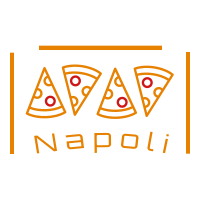

This is a [Next.js](https://nextjs.org/) project bootstrapped with [`create-next-app`](https://github.com/vercel/next.js/tree/canary/packages/create-next-app).

 
 
 <!-- PROJECT LOGO -->   
<br />
<p align="center">
  <a href="https://github.com/ChristianPredoianu/restaurant-napoliv2/">
    
  </a> 

  <h3 align="center">Restaurant Napoli - Olofström</h3>
   
  <p align="center">
   Restaurant Napoli
    <br />
    <a href="https://github.com/ChristianPredoianu/restaurant-napoliv2"><strong>Explore the docs »</strong></a>
    <br />
    <br />
    <a href="https://napoliolofstrom.se/">View Demo</a>
    ·
    <a href="https://github.com/ChristianPredoianu/restaurant-napoliv2/issues">Report Bug</a>
    ·  
   
  </p>
</p>

 

<!-- TABLE OF CONTENTS -->
<details open="open">
  <summary><h2 style="display: inline-block">Table of Contents</h2></summary>
  <ol>
    <li>
      <a href="#about-the-project">About The Project</a>
      <ul>
        <li><a href="#built-with">Built With</a></li>
      </ul>
    </li>
    <li>
      <a href="#getting-started">Getting Started</a>
      <ul>
        <li><a href="#prerequisites">Prerequisites</a></li>
        <li><a href="#installation">Installation</a></li>
      </ul>
    </li>
    <li><a href="#usage">Usage</a></li>
    <li><a href="#license">License</a></li>
    <li><a href="#contact">Contact</a></li>
    <li><a href="#acknowledgements">Acknowledgements</a></li>
  </ol>
</details>


<!-- ABOUT THE PROJECT -->
## About The Project

A Netflix clone made with Vue 3 + Vite + Firebase to mimic Netflix functionality.

### Built With

* [Next.js](https://nextjs.org/)
* [HTML5](https://developer.mozilla.org/en-US/docs/Glossary/HTML5)
* [Tailwind](https://tailwindcss.com/)
* [Firebase](https://firebase.google.com/)
* [GSAP](https://greensock.com/gsap/)
* [Swiper.js](https://swiperjs.com/)
* [Classnames](https://jedwatson.github.io/classnames/)


<!-- GETTING STARTED -->
## Getting Started

To get a local copy up and running follow these simple steps.

### Prerequisites

* npm
  ```sh
  npm install npm@latest -g
  ```

### Installation

1. Clone the repo
   ```sh
   git clone https://github.com/ChristianPredoianu/restaurant-napoliv2
   ```
2. Install NPM packages
   ```sh
   npm install
   ``` 
3. Serve with hot reload at localhost:3000
   ```sh
    npm run dev
   ``` 
5. Build for production 
   ```sh
    npm run build
   
   ```

   

   
   
   
   
   
<!-- USAGE EXAMPLES -->
## Usage


Navigate around the website, turn on or off dark mode. Admin has the possibility to log in with credentials and update the lunches of the week section. 

 


<!-- LICENSE -->
## License

Distributed under the MIT License. See `LICENSE` for more information.


<!-- CONTACT -->
## Contact

Christian Predoianu - [@linkedin](https://se.linkedin.com/in/christian-predoianu-369218157) - christianpredoianu@yahoo.com

Project Link: [https://github.com/ChristianPredoianu/netflix-clone-v2](https://github.com/ChristianPredoianu/restaurant-napoliv2)


<!-- ACKNOWLEDGEMENTS --> 
## Acknowledgements
* [Google Fonts](https://fonts.google.com/)
* [Font-Awesome](https://fontawesome.com/)


<!-- MARKDOWN LINKS & IMAGES -->
<!-- https://www.markdownguide.org/basic-syntax/#reference-style-links -->
[contributors-shield]: https://img.shields.io/github/contributors/github_username/repo.svg?style=for-the-badge
[contributors-url]: https://github.com/github_username/repo/graphs/contributors
[forks-shield]: https://img.shields.io/github/forks/github_username/repo.svg?style=for-the-badge
[forks-url]: https://github.com/github_username/repo/network/members
[stars-shield]: https://img.shields.io/github/stars/github_username/repo.svg?style=for-the-badge
[stars-url]: https://github.com/github_username/repo/stargazers
[issues-shield]: https://img.shields.io/github/issues/github_username/repo.svg?style=for-the-badge
[issues-url]: https://github.com/github_username/repo/issues
[license-shield]: https://img.shields.io/github/license/github_username/repo.svg?style=for-the-badge 
[license-url]: https://github.com/github_username/repo/blob/master/LICENSE.txt 
[linkedin-shield]: https://img.shields.io/badge/-LinkedIn-black.svg?style=for-the-badge&logo=linkedin&colorB=555
[linkedin-url]: https://linkedin.com/in/github_username    
 
 
